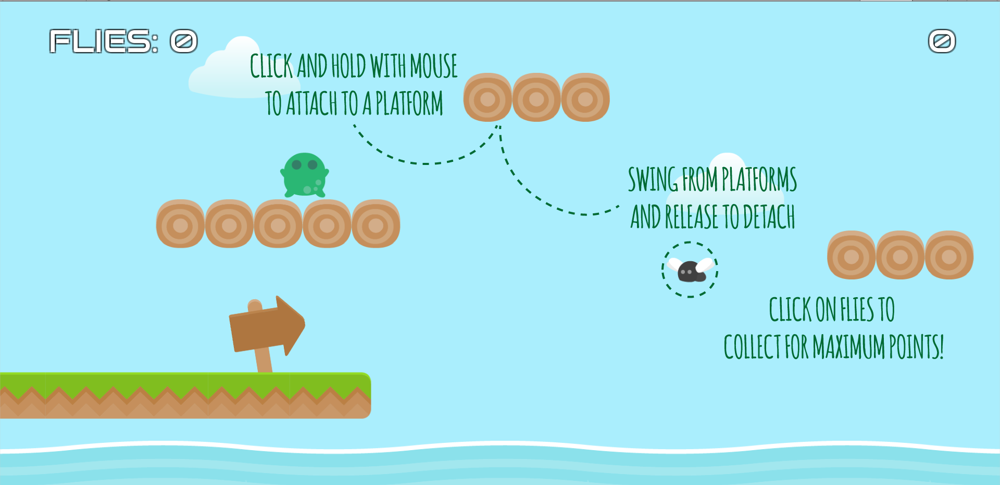

# FROGGEST

An infinite "runner" with rope physics.

## Note to IGGI assessors:
The A/B versions of the game are available through the `Score` script attached to the `Player` object in the main scene. Change the fly collection method using the options there.
